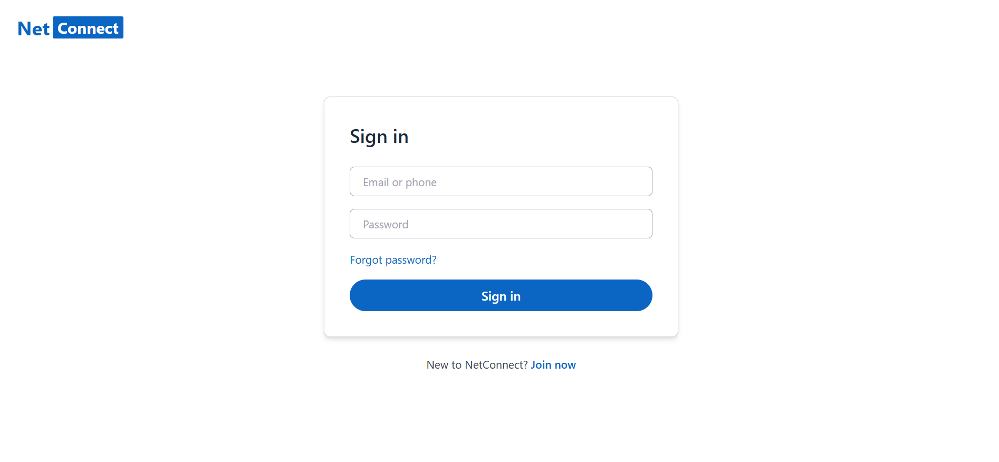

# 🧑‍💼 NetConnect - A LinkedIn Clone (MERN Stack)

NetConnect is a **LinkedIn-inspired social networking platform** built using the **MERN stack (MongoDB, Express.js, React, Node.js)**.  
It allows users to register, log in, create posts, like and comment on posts — all in a **modern, LinkedIn-style interface**.

---

## 🧩 Tech Stack

**Frontend:** React.js, Tailwind CSS  
**Backend:** Node.js, Express.js  
**Database:** MongoDB (Mongoose ORM)  
**Authentication:** JSON Web Tokens (JWT)  
**Deployment:** Render (Backend) & Vercel (Frontend)

---

## 🚀 Features

### 👤 User Authentication
- Secure registration and login using JWT  
- Protected routes for logged-in users  

### 📰 Post Management
- Create, edit, and delete posts  
- Like/unlike posts  
- Display total likes and comments  

### 💬 Comments
- Add comments to posts  
- Real-time comment updates (view-only)

### 🎨 UI/UX
- Fully responsive and LinkedIn-inspired design  
- Smooth transitions and custom toast notifications  
- Clean layout with left sidebar (profile), center feed, and right sidebar (news section)

---

## ⚙️ How to Run the Project

### 1. Clone the Repository
```bash
git clone https://github.com/SakshamChaurasiya/NetConnect.git
cd netconnect
```

### 2. Install Dependencies
#### Backend
```bash
cd server
npm install
```

#### Frontend
```bash
cd ../client
npm install
```

### 3. Configure Environment Variables

#### Backend (.env)
```
MONGO_URI=<your_mongo_connection_string>
JWT_SECRET=<your_jwt_secret>
CLIENT_URL=<your_frontend_url>
PORT=7001
```

#### Frontend (.env)
```
VITE_API_BASE_URL=<your_backend_api_url>
```

### 4. Run the App
Start the backend:
```bash
cd server
npm start
```

Start the frontend:
```bash
cd client
npm run dev
```

Then visit:  
👉 **Frontend:** http://localhost:5173  
👉 **Backend:** http://localhost:7001

---

## 📸 Screenshots

### 🏠 Home Feed


### 👤 Login Page


---

## 👨‍💻 Developer

**Developed by:** [Saksham Chaurasiya](https://www.linkedin.com/in/saksham-chaurasiya-14f/)  
If you liked this project, connect with me on LinkedIn or leave a ⭐ on the repository!

---

## 📝 License
This project is open-source and available under the [MIT License](LICENSE).
